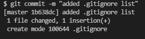
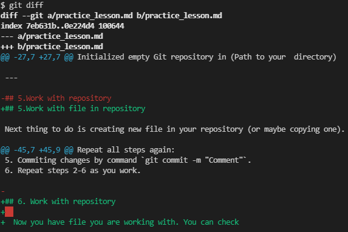
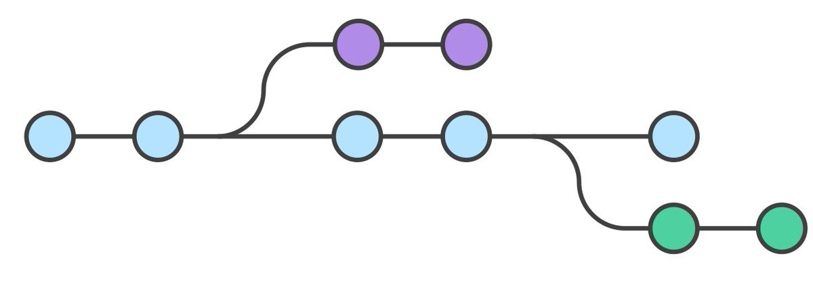
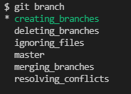

# Git practice instruction 


## 1. Checking  installed git version

Execute command `git version` in terminal.
If git is installed, a message with current version will appear. If not, message with an error.

## 2. Git install
Download latest version of git from https://git-scm.com/downloads. Install it.

## 3. Git setting
First use: you have to introduce yourself by entering two commands:
```
git config --global user.name "Your name"
git config --global user.mail "e-mail"
```

## 4. Creating your first repository

After setting git you have to create __repository__ for your further work. To do this, use the command `git init` in terminal.
After this you receive next message:

---
Initialized empty Git repository in (Path to your  directory)

---

## 5.Work with file in repository
 
Next thing to do is creating new file in your repository (or maybe copying one). For example create file "practice_lesson.md". Always remember that the **file must have an extension**. 

Git doesn't version control your file yet, we need to tell it to do this by using command `git add (file_name)`. After this git starts to control versions of added file and you can work further. Remember to save file after making any changes by pressing __Ctrl+S__ (for Windows) or **Command+S** (for  Mac).

Now to commit any changes we need use command `git commit -m "Comment"`. After use you get this:



Repeat all steps again:
1. Create file with an extension.
2. Work with file.
3. Saving file.
4. Adding file by command `git add (file_name)`.
5. Commiting changes by command `git commit -m "Comment"`.
6. Repeat steps 2-6 as you work.

## 6. Work with repository
  
  Now you have file you are working with. You can check status of it by using command `git status`. If you change nothing next message will appear (or you don't save your changes yet):
  
  ```
  $ git status
On branch master
nothing to commit, working tree clean
```
Else  if you have not commited changes this message appear:
```
On branch master
Changes not staged for commit:
  (use "git add <file>..." to update what will be committed)
  (use "git restore <file>..." to discard changes in working directory)
        modified:   practice_lesson.md

no changes added to commit (use "git add" and/or "git commit -a")
```

Also you can check changes between commits by command `git diff`.
The `git diff` command shows the differences between the files in two commits or between your current repository and a previous commit.
You get next lines in terminal:



The red one show lines that was deleted from previous commit/
The green one shows lines that was added.

Also you can see made commits by command `git log`.
It shows unique hash number of a commit, author of the commit, date and a comment added in the commit.

**Example:**
```
$ git log
commit 9a12825c5e955f1037c82bb8207c53c8c6c9d00f (HEAD -> master)
Author: Sergei_Pospelov <pospelka413@gmail.com>
Date:   Sun Feb 13 14:30:08 2022 +0300

    change name

commit 73a0926b51c4f981929b53f2d8a5d8e02e33cf94
Author: Sergei_Pospelov <pospelka413@gmail.com>
Date:   Sun Feb 13 14:27:14 2022 +0300

    added git diff.png

commit 7b399c6795e2efe67f8eef246fd203a5c94b52ac
Author: Sergei_Pospelov <pospelka413@gmail.com>
Date:   Sun Feb 13 13:55:44 2022 +0300

    Git commit instruction added
```
Also you can switch over commits by using command `git checkout (name)`.
Instead of a `(name)` you can insert a unique hash number (or **at least four digits** of it).
After that you get your file status at the moment commit was created.
**Example**

```
$ git checkout 7b399c6
Note: switching to '7b399c6'.

You are in 'detached HEAD' state. You can look around, make experimental
changes and commit them, and you can discard any commits you make in this
state without impacting any branches by switching back to a branch.

If you want to create a new branch to retain commits you create, you may
do so (now or later) by using -c with the switch command. Example:

  git switch -c <new-branch-name>

Or undo this operation with:

  git switch -

Turn off this advice by setting config variable advice.detachedHead to false

HEAD is now at 7b399c6 Git commit instruction added
```

If you want to go back you need to do this  `git checkout master`, and you switch to last state of your file (called __master__).

**Example**
```
$ git checkout master
Previous HEAD position was 7b399c6 Git commit instruction added
Switched to branch 'master'
```

## 7. Ignoring files, using .gitignore
Not all files created or updated in the code should be committed to **Git**. Temporary files from the development environment, test outputs and logs, images are all examples of files that are created, but are not part of the code base.
For these purposes , we will create and use file `.gitignore.`
File `.gitignore` allows you to exclude files from checking in the repository. 
It is a simple text file, each line of which contains a file or directory template that must be ignored.

For example:
```
1. Gitlogo.png
2. git_commit.png
3. *.jpg
```
First and second line contains exact names of image files that should be ignored.
Third line tells Git to ignore **ALL** .jpg files in the directory.
More about `.gitignore` file structure: https://git-scm.com/docs/gitignore 


## 8.Git branches and working with them
A branch, at its core, is a unique series of code changes with a unique name. Each repository can have one or more branches.
 


### 8.1. Creating branches in Git
To create a new branch, use the command `git branch <branch_name>`
To check if a branch has been created, as well as to see the _list_ of already created ones, use the command `git branch`  (note the differences from the previous one).

---


---

The example shows a *list* of created branches. The branch named **master** is the main one by default and is created at the time of repository initialization by the `git init` command. The rest of the branches are created by the user with the command `git branch <branch_name>`. It should be noted that an _asterisk_ marks the **currently active branch** (also it is showed green). 

Switching between branches using the already familiar `git checkout <branch_name>` command.
Also you can create and switch to a branch simultaneously by using command `git checkout -b <branch_name>`

### 8.2. Merging branches

Merging is used in Git to piece together a branched history. The `git merge` command merges individual branches created using the `git branch` command into a single branch.
The `git merge` command combines several commit sequences into a common history. Most often, the `git merge` command is used to merge two branches. In such cases, the git merge command takes two pointers to commits (usually the last ones in the branch) and finds a parent commit common to them. Git then creates a __merge commit__ that combines the changes from both sequences selected for the merge.

Before merging, several preparatory actions should be taken so that the operation goes without problems. Use the `git status` command. This will make sure that the HEAD points to the branch receiving the merge results. If necessary, run the `git checkout <receiving_branch>` command to switch to the host branch. For example, run the `git checkout master` command.

After the above steps, you can proceed to **merge**. To do this, run the `git merge <receiving_branch>` command, where <receiving_branch> is the name of the branch that will be merged with the host (master branch as example).

### 8.3. Resolving merge conflicts
Add text to create conflict
### 8.4. Deleting branches

## 9.Remote repo. working with GitHub.